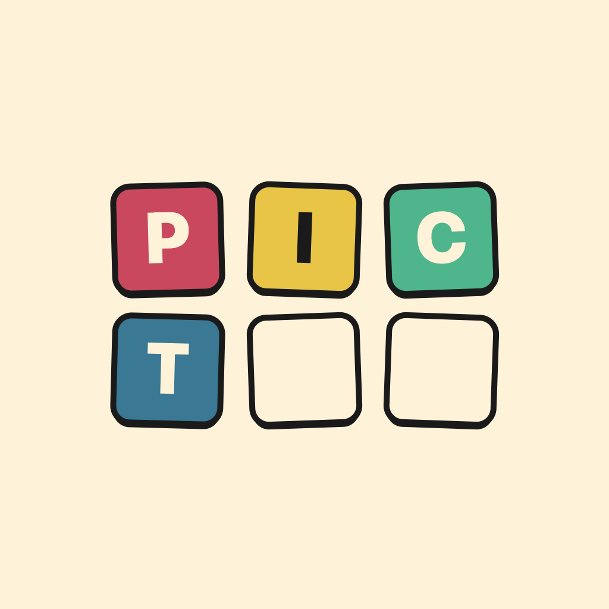

# Pictok

A daily emoji-decode puzzle game. One puzzle a day. Decode the emojis into a word. Keep your streak alive.

- **Web:** [https://pictok.pages.dev](https://pictok.pages.dev) (live)
- **iOS:** Personal Team build, TestFlight pending



## What is it

Pictok shows you a string of emojis where each emoji represents a word. You guess the answer hangman-style by tapping letters on an on-screen keyboard.

Some puzzles are literal compounds:

```
🐱🐟 = CATFISH
🌴📖 = THE JUNGLE BOOK
🍔👑 = BURGER KING
```

Others are rebus puns where the emoji's spoken name maps to a syllable in the answer:

```
🐝🍃 = BELIEF        (bee + leaf → "be-lief")
🐻🦶 = BAREFOOT      (bear → "bare" + foot)
🅰️🐝🛣️ = ABBEY ROAD  (A + bee → "abbey" + road)
```

You get 5 hearts. Each wrong letter costs one. Hints exist but cost hearts too. Solve daily to build your streak; miss a day and it resets.

## Stack

- **Swift 5.9+, SwiftUI**
- **iOS 17+** (uses `@Observable`, `ShareLink`)
- **Zero external dependencies** — pure Foundation, SwiftUI, AVFoundation, UserNotifications
- **Local-only persistence** — single JSON blob in `UserDefaults`, no backend
- **Tested with XCTest** — `GameEngineTests`, `ShareCardBuilderTests`, `NotificationSchedulerTests`, `UserStateCodableTests`, `UserStateStoreTests`, `PuzzleLoaderTests`, `PuzzleDecodingTests`

## Repo layout

```
Pictok/
├── PictokApp.swift                          # @main App entry
├── Resources/
│   ├── puzzles.json                         # 59 hand-authored puzzles
│   ├── Assets.xcassets/                     # App icon, color sets
│   └── Sounds/                              # correct.wav, wrong.wav, win.wav
├── Models/         Puzzle, Category, Difficulty, UserState, HintType
├── Game/           GameEngine, UserStateStore, PuzzleLoader,
│                   ShareCardBuilder, NotificationScheduler,
│                   HapticsService, SoundService
└── Views/          TodayView, ResultSheet, NotificationPermissionSheet,
                    StatsView, HowToPlayView, Theme, Components/

PictokTests/        Test files covering models, game logic, share card,
                    notification scheduling, state persistence, puzzle loading

web/                Feature-parity browser version (vanilla HTML/CSS/JS,
├── index.html      no build step). Deployed to Cloudflare Pages at
├── style.css       pictok.pages.dev. Companion to the iOS app — share
├── js/             links from iOS open into the playable web game.
├── puzzles.json    Synced from Pictok/Resources/puzzles.json via
└── sounds/         web/sync-puzzles.sh.

docs/
├── superpowers/specs/                       # v1 design spec
├── superpowers/plans/                       # 31-task implementation plan
└── launch/                                  # App Store listing, privacy
                                             # policy, sound sourcing, icon brief
```

## Architecture

Three layers with clear boundaries:

- **Models** — pure Codable types, no SwiftUI imports, no I/O
- **Game** — pure logic + one persistence wrapper (`UserStateStore`) that's the only thing touching `UserDefaults`
- **Views** — thin SwiftUI screens that read from the store via `@Bindable` and call into game logic. No business logic in views.

The whole app is built so the game logic is unit-testable without the simulator running.

## Building

Requires Xcode 15+ and an iOS 17+ simulator or device.

```bash
xcodebuild test \
  -project Pictok.xcodeproj \
  -scheme Pictok \
  -destination 'platform=iOS Simulator,name=iPhone 15,OS=latest'
```

Or open `Pictok.xcodeproj` in Xcode and press ⌘R to run, ⌘U to test.

## Status

v1 in development. See [`docs/superpowers/specs/2026-05-18-emoji-decode-design.md`](docs/superpowers/specs/2026-05-18-emoji-decode-design.md) for the locked spec and [`docs/superpowers/plans/2026-05-18-pictok-v1-implementation.md`](docs/superpowers/plans/2026-05-18-pictok-v1-implementation.md) for the implementation plan.

## License

[YOUR_LICENSE — typically MIT for solo iOS projects, or All Rights Reserved if you'd rather not open source]
